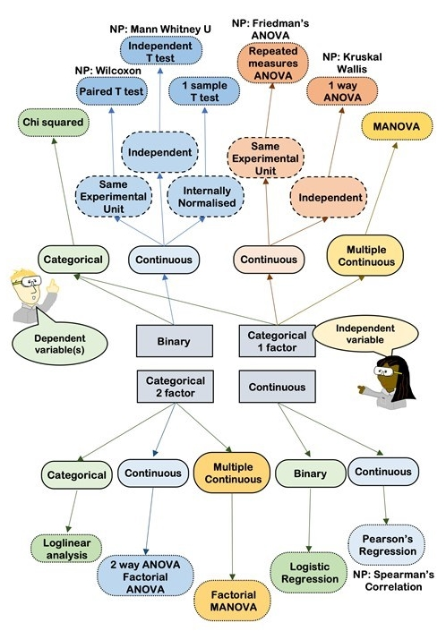
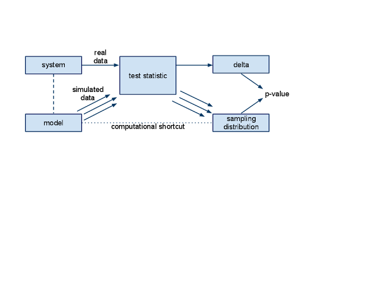
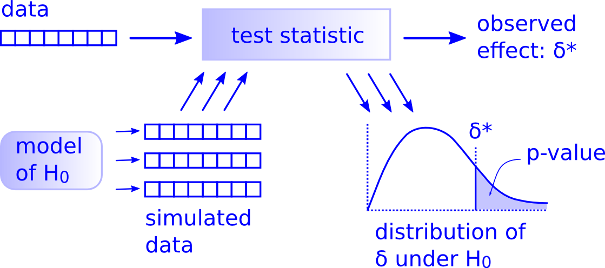

# Housekeeping

**Problem Set 7** incoming after class. Due Tuesday April 21. (Will probably have Problem Set 8 as last problem set).

**Literature Presentations 3** - Thursday April 16th, in class. Papers assigned asap.

**Exam 2** - yes, still grading.

# Lecture

Discussion: What is statistical uncertainty and how do we use it?

## Hypothesis Tests

Hypothesis tests answer the question "Is an effect real or due to chance?" by formulating two hypotheses:

Null hypothesis (H~0~)

:   A model of the system if the effect is due to random chance.

Alternative hypothesis (H~a~)

:   A model of the system where the effect is real.

Typically we calculate P(TestStatistic\|H~0~), which is the **p-value**. Different kinds of tests are different ways of calculating this value that avoid computation, deriving from days when computation was expensive.





### "There is only one test"

#### General framework: 

1\) Compute a test statistic from your data ($\delta^*$) - this measures the size of an effect, like the difference between the means of an experimental group and a control group.

2\) Define a null hypothesis - a model built with the assumption that the effect from (1) is not real (e.g., no difference in the means. $H_0: \mu_A = \mu_B$). In other words, a world where $\delta$ is null (basically, zero). This model should generate random *datasets* (yes, many).

3\) Compute a test statistic ($\delta$) for each dataset generated under the null hypothesis, computed the same way as it was for your data.

4\) Compute a p-value - count the fraction of times the test statistic from the simulated datasets (under the null hypothesis, i.e., all of the $\delta$ values) exceeds the test statistic from your data ($\delta^*$). This is calculating the probability that

5\) Decide if the p-value ($P$) meets an evidentiary standard to reject the null (or fail to reject the null). We call this threshold $\alpha$ and typically set it to $\alpha = 0.05$ - if $P < 0.05$, we *reject* $H_0$, and if $P \ge 0.05$ we *fail to reject* $H_0$ implying evidence for the alternative hypothesis, $H_A$ (e.g., $H_A: \mu_A \neq \mu_B$).

As [Andrew Heiss](https://www.andrewheiss.com/blog/2018/12/05/test-any-hypothesis/) and [Andrew Downey](https://allendowney.blogspot.com/2016/06/there-is-still-only-one-test.html) put it: "All hypothesis tests fit into this framework." "Five steps. No need to follow complicated flowcharts to select the best and most appropriate statistical test. No need to run a bunch of tests to see if you need to pool variances or leave them separate. Calculate a number, simulate a null world, and decide if that number is significantly different from what is typically seen in the null world."



### Implementing the One Test

#### Test statistic

First we need to have data to calculate an observed test statistic. Let's do what we do and simulate a case where we know the answer.

Let's say we're interested in testing the mean ATP synthesis (mg per g biomass per h) of fungi in a control group living on a hay substrate and an experimental group living on hay with acetate added.

```{r, message = FALSE, warning=FALSE}
library(tidyverse)
library(infer)

```

```{r}

set.seed(90)
n <- 10
atp_df <- tibble(group = c(rep("Control", n), rep("Experimental", n)))|>
  mutate(atp_synth = ifelse(group == "Control", 
                            rnorm(n, mean = 10, sd = 2),
                            rnorm(n, mean = 13, sd = 2)))

ggplot(atp_df, aes(x = group, y = atp_synth))+
  geom_point()

delta_star <- atp_df|>
  group_by(group)|>
  summarize(atp_synth = mean(atp_synth))|>
  summarize(diff = diff(atp_synth))|>
  pull(diff)
delta_star
  
```

What's the calculated effect ($\delta^*$) of the experiment here if our question is a difference in means?

We can use as our 'data' to test $H_0: \mu_A = \mu_B$ (or alternately, $H_A: \mu_A \neq \mu_B$).

### Creating a null world

How do we create a model where our null hypothesis is true?

Remember bootstrapping? Instead of randomly sampling with replacement, let's randomly existing assign labels to our values. So we're *reshuffling* our data to simulate how these values could be generated by random chance. This is called **permutation**: changing the order of a set of values.

Here, `sample()` is used with the default argument `replace = FALSE`.

```{r}
set.seed(90)
atp_df
atp_permdf1 <- atp_df|>
  mutate(group = sample(group))

atp_permdf1
ggplot(atp_permdf1, aes(x = group, y = atp_synth))+
  geom_point()
```

So the values of `atp_synth` stay the same, but the group labels are randomized. *On average*, this means that the association/correlation between group and atp_synth is broken. By the way, this is really what randomization in experimentation is doing - randomly assigning treatments to individuals/units *on average* breaks associations that may influence the effect of the treatment on the outcome. \
\
Now we can calculate a test statistic ($\delta$) for this permutation.

```{r}
atp_permdf1|>
  group_by(group)|>
  summarize(atp_synth = mean(atp_synth))|>
  summarize(delta = diff(atp_synth))|>
  pull(delta)
```

Of course this is different than $\delta^*$, we need to do this many times to develop a distribution of possibilities. I find base R's `replicate()` to be a little easier to understand here than purrr package use of `map_*` functions here.

Doing 9999 permutations is pretty standard, but it might take a minute.

```{r, warning = FALSE}
set.seed(3)
perms <- 9999
atp_permdf <- replicate(perms, 
                        {
  atp_df|>
  mutate(group = sample(group))|>
  group_by(group)|>
  summarize(atp_synth = mean(atp_synth))|>
  summarize(delta = diff(atp_synth))|>
  pull(delta)
         
 }                       
)|>
  as_tibble()|>rename(ts_delta = "value")

ggplot(atp_permdf, aes(x = ts_delta))+
  geom_histogram()+
  xlab(expression(delta))+
  theme_bw()+theme(axis.title.x = element_text(size = 20, face = "bold"))
```

Now let's compare our null worlds with our observed data.

```{r, warning = FALSE, message = FALSE}
ggplot()+
  geom_histogram(data = atp_permdf, aes(x = ts_delta))+
  geom_vline(aes(xintercept = c(-delta_star,delta_star)), color = "red", size = 1.5)+
  geom_text(aes(x = 0.87*delta_star, y = 750), label = expression(delta^"*"), size = 16, color = "red")+
  xlab(expression(delta))+ylab("Count")+
  theme_bw()+theme(axis.title.x = element_text(size = 20, face = "bold"))
```

### Calculate a P-value

```{r}
blah <- atp_permdf|>
  mutate(delta_le_deltastar = ifelse(abs(ts_delta) >= abs(delta_star), TRUE, FALSE))|>
  group_by(delta_le_deltastar)|>
  summarize(count = n(), prop = count/perms)
```

So here P = 0.003, which is less than 0.05. Here we would reject the null hypothesis and say there is a 'significant' difference in the group means.

In a world where delta is 0, there's a 0.3% chance of seeing our observed test statistic or something more extreme.

#### Quick note on decision making and error rates

$\alpha = 0.05$ implies we're using a hypothesis testing procedure that in the long run would *incorrectly* reject $H_0$ 5% of the time.

*Type I errors* - False positives: "Significant difference!" but reality is there is not one (i.e., incorrectly rejecting $H_0$).

*Type II errors* - False negatives: "Ain't no difference!" but reality is there is one.

Does our chosen alpha reflect a trade-off in Type I and Type II errors?

*S values* - log2(P): S for "Surprise" Brings intuition to Pvalues and can be interpreted as \~number of heads in a row.

### An easier way with the `{infer}` package

I used `replicate()` above and `infer::rep_sample_n()` and `rsample::bootstraps()` in previous lectures to make the process a little more bare bones, but `{infer}` is meant to streamline this process. Let's try the steps again with the `{infer}` workflow.

#### Calculate the test statistic

First let's generate an observed test statistic. `specify` works a little like `lm()` in that it expects a formula like `Response ~ Predictor`. Then we can calculate $\delta^*$ as the difference in means using `calculate()` by specifying the statistic and optionally ensuring the order of the calculation of that statistic is what we want in this case the Experimental - Control.

```{r}
delta_infer <- atp_df|>
  specify(atp_synth ~ group)|>
  calculate(stat = "diff in means", order = c("Experimental","Control"))
```

Exact same value: `r delta_star`.

#### Generate a null world

This manages to go a lot faster than my replicate version likely due to some optimization in the way the code is written.

```{r}
set.seed(3)
shuffled_deltas <- atp_df|>
  specify(atp_synth ~ group)|>
  hypothesize(null = "independence")|>
  generate(reps = 9999, type = "permute")|>
  calculate(stat = "diff in means", order = c("Experimental","Control"))
```

#### Compare the observed statistic with the null world

```{r}
shuffled_deltas|>
  visualize()+
  shade_p_value(obs_stat = delta_infer, direction = "two sided")
```

#### Calculate a P-value

```{r}
shuffled_deltas |>
  get_p_value(obs_stat = delta_infer, direction = "two sided")
```

How do P values compare with confidence intervals in terms of using their cutoffs to make decisions about significance?

## Named tests and linear models

Next time.

# Discussion

We're coming to the end of the class materials - here's what's planned:

Discussion of named hypothesis tests and linear models (t-tests, ANOVA, chi-square, etc.). Literature presentations on, broadly, poor research practices like P-hacking. A priori power analysis and design.

What kind of statistical, data science, or open science concepts do you want to see?

```{r}
set.seed(90)
n <- 10
blah_df <- tibble(group = c(rep("Control", n), rep("Experimental", n)))|>
  mutate(blah = ifelse(group == "Control", 
                            rgamma(n, 1, 0.1),
                            rgamma(n, 1,1)))

ggplot(blah_df, aes(x = group, y = blah))+
  geom_point()#+scale_y_log10()

blah_star <- blah_df|>
  group_by(group)|>
  summarize(blah = mean(blah))|>
  summarize(diff = diff(blah))|>
  pull(diff)
blah_star

blah_infer <- blah_df|>
  specify(blah ~ group)|>
  calculate(stat = "t", order = c("Experimental","Control"))

shuffled_blah <- blah_df|>
  specify(blah ~ group)|>
  hypothesize(null = "independence")|>
  generate(reps = 9999, type = "permute")|>
  calculate(stat = "t", order = c("Experimental","Control"))

shuffled_blah|>
  visualize()+
  shade_p_value(obs_stat = blah_infer, direction = "both")
  
shuffled_blah|>
  get_p_value(obs_stat = blah_infer, direction = "both")
```
